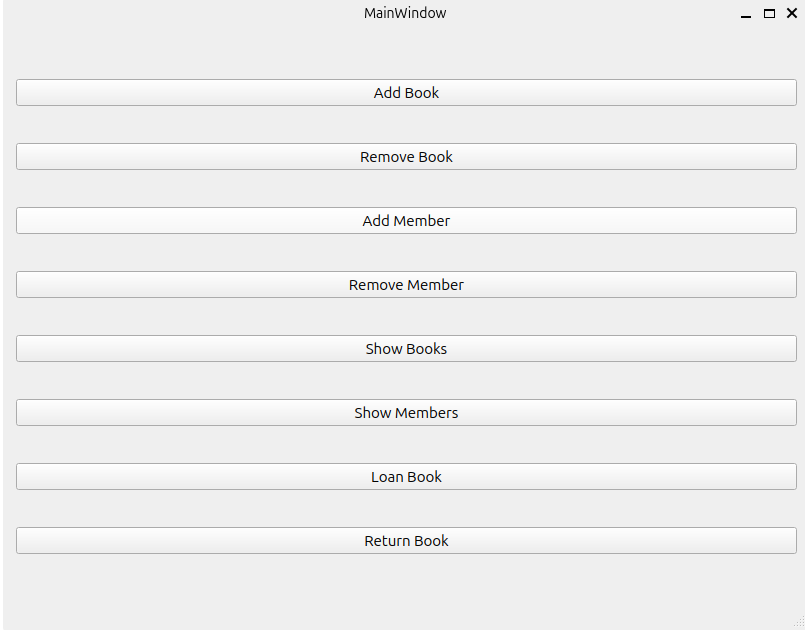

# Library Management System (v1.0)

This is the first version of a modular Library Management System built with **Python** and **PyQt5**. It follows the MVC (Model-View-Controller) architecture and includes a graphical user interface.

## 📁 Project Structure

- `main.py` : Entry point of the application
- `models/` : Data models (e.g. `Book`, `Member`)
- `controllers/` : Business logic and core functionality
- `views/` : Bridge between the UI and the controller
- `ui/` : PyQt5-generated UI forms
- `utils/` : Utility modules (e.g. logging)

## ✨ Features

- Add, and remove books in the library.
- Add and remove library members.
- Issue (lend) books to members.
- Return books .
- Display lists of all books and members.
- Simple and intuitive graphical user interface built with PyQt5.
- Modular architecture for easy maintenance and future extension.

## 📦 Installation

1. Clone the repository:

    git clone https://github.com/mrezdevb/pyqt5-library-mvc.git

2. Install dependencies:

    pip install -r requirements.txt

## 🎮 Usage

Run the application with:

    python3 main.py

Use the GUI to manage books, members, and borrowing operations.

## 🤝 Contributing

Contributions are welcome! Please open an issue or submit a pull request for any improvements or bug fixes.

## 📄 License

This project is licensed under the MIT License. See the LICENSE file for details.

## 📸 Screenshots

## ⚠️ Known Issues / Limitations

- Currently no persistent database; data is lost on application close.
- No user authentication or role management yet.
- Limited search and filter capabilities.

## 🔮 Roadmap / Future Plans

- Integrate persistent database (e.g., SQLite).
- Add user authentication and role-based access.
- Improve search and filtering options.
- Enhance UI/UX with better design and responsiveness.

## 📞 Contact / Author

Mohammadreza Mahdian  
Email: mrez.devb@gmail.com  
GitHub: https://github.com/mrezdevb

